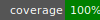

| **EN** | [ru](README-ru.md) |
|----------|----------|

# is-kramdown-hooked

[](LICENSE)
[](https://badge.fury.io/rb/is-kramdown-hooked)
[](https://github.com/jekyll-is/is-kramdown-hooked/actions/workflows/ruby.yml)


Extensible Kramdown parser with inner hooks for enhanced Markdown processing in Jekyll.

## About

is-kramdown-hooked is a flexible Ruby gem that extends the standard Kramdown Markdown parser by adding customizable post-parse hooks. These hooks enable developers to inject custom processing steps on the Abstract Syntax Tree (AST) after the default parsing, allowing for advanced Markdown manipulation and seamless integration into Jekyll sites or other Ruby projects using Kramdown.

## Features

- Inherits from Kramdown's parser while allowing registration of multiple post-parse hooks
- Hooks receive the parser instance to inspect or modify the AST
- Flexible extension point for custom Markdown transformations
- Lightweight and easy to integrate as a Jekyll plugin or standalone gem
- Tested with RSpec and coverage ensured with SimpleCov
- Compatible with Ruby 3.4 and Kramdown 2.5+

## Installation

Add this line to your Jekyll site's `Gemfile` or any Ruby project's Gemfile:

```ruby
gem 'is-kramdown-hooked', '~> 0.8.0'
```

Then run:

```shell
bundle install
```

## Usage

Register a post-parse hook in your Ruby code:

```ruby
Kramdown::Parser::ISKram.register_post_parse_hook do |parser|
  # Custom AST processing logic here
  # Example: modify parser.root to transform Markdown nodes
end

# Parse Markdown source with the custom parser
doc = Kramdown::Document.new(markdown_source, input: 'ISKram')
```

This will run your hook after the default Kramdown parsing, allowing customized manipulation of the document structure.

## Development

### Prerequisites

- Ruby ~> 3.4
- Bundler
- Kramdown ~> 2.5

### Running tests

To run the test suite, clone the repository and execute:

```shell
bundle exec rake
```

Code coverage is reported using SimpleCov.

### Contributing

Contributions are welcome. Please fork the repository and submit pull requests with descriptive commit messages. Ensure all tests pass.

## License

This project is licensed under the GPL-3.0-or-later license.

## Links

- Homepage: https://github.com/jekyll-is/is-kramdown-hooked
